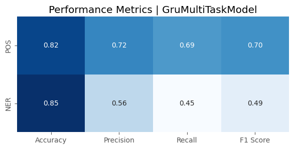
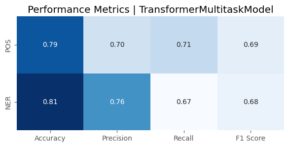

# Part-Of-Speech and Named Entity Recognition System

This project is a part-of-speech and named entity recognition system. It is built using PyTorch and trained on a dataset of Bengali text. The system can identify the part-of-speech (POS) and named entity (NER) of words in the text.

The system consists of a data loader, a model architecture, and a set of utility functions. The data loader loads the data from a CSV file into a dataframe and prepares it for training. The model architecture is a multi-task model that predicts POS and NER simultaneously. The utility functions are used to calculate metrics such as accuracy, precision, recall, and F1-score.

The system can be used to analyze various languages and identify the part-of-speech and named entity of words in the text.

## Usage
Install the package first
```bash
pip install git+https://github.com/SayedShaun/POS-NER.git
``` 
Here is the step by step guide to use the package
``` python
# Import the necessary libraries
import torch
from pos_ner import GruMultiTaskModel, Config, Data

# First load the data e.g. csv or dataframe
data = Data(dataframe or "csv file path")
# Configure the hyperparameter as necessary
config = Config(vocab_size=Data.vocab_size, pos_size=Data.pos_size, ner_size=Data.ner_size, n_ctx=100)
# Build the dataloader
train_ds, val_ds = data.build_dataloader(256, config.n_ctx, 0.8)
# Select the model
model = GruMultiTaskModel(config).to(device)
# Define the loss function and optimizer
loss_fn = nn.CrossEntropyLoss()
optimizer = torch.optim.Adam(model.parameters(), lr=1e-3)
# Train the model with necessary parameters
model.fit(10, loss_fn, optimizer, train_ds, val_ds, callbacks=True)
# Get predictions
model.predict("শনিবার ২৭ আগস্ট রাতে পটুয়াখালী সদর থানার ভারপ্রাপ্ত কর্মকর্তা")
# For In-depth Reports
model.test_report(data.test_df.head(100))
```
## Model Details:
We have tested two models architectures Gru Based Model and Transformer Based Model. Both Model architectures are trained on the same dataset for 10 epochs with callbacks. In this particular task Gru based model gives better performance. Gru based model gives slightly better accuracy than transformer based model.

## Results
We have tested Gru based model and Transformer based model with same dataset for 10 epochs with callbacks. Gru gives slightly better performance. Though Transformer model known for better performance with very large dataset.Here is the performance of Gru based model and Transformer based model's performance. for training details please checkout the Results directory.




## Recommendations:
While i trained both model with very minimal hyperparameter tuning, you can do some hyperparameter tuning to improve performance. Even increasing dataset size can help in improving performance.


